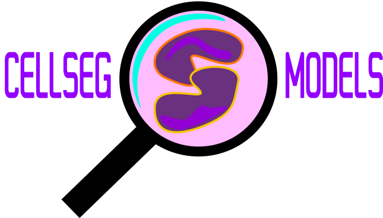

<div align="center">



**Python library for 2D cell/nuclei instance segmentation models written with [PyTorch](https://pytorch.org/).**

[](https://github.com/okunator/cellseg_models.pytorch/blob/master/LICENSE)
[](https://pytorch.org/)
[](https://www.python.org/)
<br>
[](https://github.com/okunator/cellseg_models.pytorch/actions/workflows/tests.yml)
[](https://github.com/psf/black)
[](https://codecov.io/gh/okunator/cellseg_models.pytorch)
<br>
[](https://pypi.org/project/cellseg-models-pytorch/)

</div>

<div align="center">

</div>

## Introduction

Contains multi-task encoder-decoder architectures (U-Net-like) along with dedicated post-processing methods for segmenting cell/nuclei instances. As the name suggests, this library is heavily inspired by [segmentation_models.pytorch](https://github.com/qubvel/segmentation_models.pytorch) library for semantic segmentation.

<br><br>


## Installation

**Basic installation**

```shell
pip install cellseg-models-pytorch
```

**To install extra dependencies (training utilities and datamodules for open-source datasets) use**

```shell
pip install cellseg-models-pytorch[all]
```

## Features

- High level API to define cell/nuclei instance segmentation models.
- 4 notorious cell/nuclei instance segmentation models and more to come.
- Pre-trained backbones/encoders from the notorious [timm](https://github.com/rwightman/pytorch-image-models) library.
- All the architectures can be augmented to output semantic segmentation outputs along with instance semgentation outputs (panoptic segmentation).
- A lot of flexibility to modify the components of the model architectures.
- Optimized inference methods.
- Popular training losses and benchmarking metrics.
- Simple model training with [pytorch-lightning](https://www.pytorchlightning.ai/).
- Popular optimizers for training (provided by [pytorch-optimizer](https://github.com/jettify/pytorch-optimizer)).

## Models

| Model                      | Paper                                                                          |
| -------------------------- | ------------------------------------------------------------------------------ |
| [[1](#Citation)] HoVer-Net | https://www.sciencedirect.com/science/article/pii/S1361841519301045?via%3Dihub |
| [[2](#Citation)] Cellpose  | https://www.nature.com/articles/s41592-020-01018-x                             |
| [[3](#Citation)] Omnipose  | https://www.biorxiv.org/content/10.1101/2021.11.03.467199v2                    |
| [[4](#Citation)] Stardist  | https://arxiv.org/abs/1806.03535                                               |

## Datasets

| Dataset                     | Paper                                                                                            |
| --------------------------- | ------------------------------------------------------------------------------------------------ |
| [[5, 6](#Citation)] Pannuke | https://arxiv.org/abs/2003.10778 , https://link.springer.com/chapter/10.1007/978-3-030-23937-4_2 |

## Notebook examples

- [Training Stardist with Pannuke](https://github.com/okunator/cellseg_models.pytorch/blob/main/examples/pannuke_nuclei_segmentation_stardist.ipynb). Uses in-built training utilities and Pytorch-Lightning

## Code Examples

**Define Cellpose for cell segmentation.**

```python
import cellseg_models_pytorch as csmp
import torch

model = csmp.models.cellpose_base(type_classes=5) # num of cell types in training data=5.
x = torch.rand([1, 3, 256, 256])

# NOTE: these outputs still need post-processing to obtain instance segmentation masks.
y = model(x) # {"cellpose": [1, 2, 256, 256], "type": [1, 5, 256, 256]}
```

**Define Cellpose for cell and tissue area segmentation (Panoptic segmentation).**

```python
import cellseg_models_pytorch as csmp
import torch

model = csmp.models.cellpose_plus(type_classes=5, sem_classes=3) # num cell types and tissue types
x = torch.rand([1, 3, 256, 256])

# NOTE: these outputs still need post-processing to obtain instance and semantic segmentation masks.
y = model(x) # {"cellpose": [1, 2, 256, 256], "type": [1, 5, 256, 256], "sem": [1, 3, 256, 256]}
```

**Define panoptic Cellpose model with more flexibility.**

```python
import cellseg_models_pytorch as csmp

model = csmp.CellPoseUnet(
    decoders=("cellpose", "sem"), # cellpose and semantic decoders
    heads={"cellpose": {"cellpose": 2, "type": 5}, "sem": {"sem": 3}}, # three output heads
    depth=5, # encoder depth
    out_channels=(256, 128, 64, 32, 16), # number of out channels at each decoder stage
    layer_depths=(4, 4, 4, 4, 4), # number of conv blocks at each decoder layer
    style_channels=256, # Number of style vector channels
    enc_name="resnet50", # timm encoder
    enc_pretrain=True, # imagenet pretrained encoder
    long_skip="unetpp", # use unet++ long skips. ("unet", "unetpp", "unet3p")
    merge_policy="sum", # ("cat", "sum")
    short_skip="residual", # residual short skips. ("basic", "residual", "dense")
    normalization="bcn", # batch-channel-normalization. ("bcn", "bn", "gn", "ln", "in")
    activation="gelu", # gelu activation instead of relu. Several options for this.
    convolution="wsconv", # weight standardized conv. ("wsconv", "conv", "scaled_wsconv")
    attention="se", # squeeze-and-excitation attention. ("se", "gc", "scse", "eca")
    pre_activate=False, # normalize and activation after convolution.
)

x = torch.rand([1, 3, 256, 256])
# NOTE: these outputs still need post-processing to obtain instance and semantic segmentation masks.
y = model(x) # {"cellpose": [1, 2, 256, 256], "type": [1, 5, 256, 256], "sem": [1, 3, 256, 256]}
```

**Run HoVer-Net inference and post-processing with a sliding window approach.**

```python
import cellseg_models_pytorch as csmp

model = csmp.models.hovernet_base(type_classes=5)
# returns {"hovernet": [B, 2, H, W], "type": [B, 5, H, W], "inst": [B, 2, H, W]}

# Sliding window inference for big images using overlapping patches
inferer = csmp.inference.SlidingWindowInferer(
    model=model,
    input_folder="/path/to/images/",
    checkpoint_path="/path/to/model/weights/",
    out_activations={"hovernet": "tanh", "type": "softmax", "inst": "softmax"},
    out_boundary_weights={"hovernet": True, "type": False, "inst": False}, # smooths boundary effects
    instance_postproc="hovernet", # THE POST-PROCESSING METHOD
    patch_size=(256, 256),
    stride=128,
    padding=80,
    batch_size=8,
    normalization="percentile", # same normalization as in training
)

inferer.infer() # Run sliding window inference.

inferer.out_masks
# {"image1" :{"inst": [H, W], "type": [H, W]}, ..., "imageN" :{"inst": [H, W], "type": [H, W]}}
```

## Models API

### Class API

The class API enables the most flexibility in defining different model architectures. It allows for defining a multitude of hard-parameter sharing multi-task encoder-decoder architectures with (relatively) low effort. The class API is borrowing a lot from [segmentation_models.pytorch](https://github.com/qubvel/segmentation_models.pytorch) models API.

**Model classes**:

- `csmp.CellPoseUnet`
- `csmp.StarDistUnet`
- `csmp.HoverNet`

**All of the models contain**:

- `model.encoder` - pretrained [timm](https://github.com/rwightman/pytorch-image-models) backbone for feature extraction.
- `model.{decoder_name}_decoder` - Models can have multiple decoders with unique names.
- `model.{head_name}_seg_head` - Model decoders can have multiple segmentation heads with unique names.
- `model.forward(x)` - forward pass.

**Defining you own multi-task architecture**

For example, to define a multi-task architecture that has `resnet50` encoder, four decoders, and 5 output heads with `CellPoseUnet` architectural components, we could do this:

```python
import cellseg_models_pytorch as csmp
import torch

model = csmp.CellPoseUnet(
    decoders=("cellpose", "dist", "contour", "sem"),
    heads={
        "cellpose": {"type": 5, "cellpose": 2},
        "dist": {"dist": 1},
        "contour": {"contour": 1},
        "sem": {"sem": 4}
    },
)

x = torch.rand([1, 3, 256, 256])
model(x)
# {
#   "cellpose": [1, 2, 256, 256],
#   "type": [1, 5, 256, 256],
#   "dist": [1, 1, 256, 256],
#   "contour": [1, 1, 256, 256],
#   "sem": [1, 4, 256, 256]
# }
```

This model would give 5 outputs with names that should describe their prediction task. The names are arbitrary and there are no restrictions for them, however, during training and post-processing, these names need to match to the input names of the training or post-processing pipelines. Here, for example during training, the `"cellpose"`-head would predict x- and -y flow gradients, given that during training there would be x- and- y- gradient ground truth inputs with the same name. Similarly, `"type"`-head would predict semantic cell type masks, `"dist"`-head would predict a distance transform from the center of cell/nuclei instances, `"contour"`-head would predict cell/nuclei contours, and `"sem"`-head would predict semantic area segmentation masks. Check out the training notebooks in the `examples`-folder for more detailed info.

### Function API

With the function API, you can build models with low effort by calling the below listed functions. Under the hood, the function API simply calls the above classes with pre-defined decoder- and head names. The training- and post-processing tools of this library are built around these names, thus, it is recommended to use the function API, although, it is a bit more rigid than the class API. Basically, the function API only lacks the ability to define the output-tasks of the model, but allows for all the rest as the class API.

| Model functions                        | Output names                              | Task                             |
| -------------------------------------- | ----------------------------------------- | -------------------------------- |
| `csmp.models.cellpose_base`            | `"type"`, `"cellpose"`,                   | **instance segmentation**        |
| `csmp.models.cellpose_plus`            | `"type"`, `"cellpose"`, `"sem"`,          | **panoptic segmentation**        |
| `csmp.models.omnipose_base`            | `"type"`, `"omnipose"`                    | **instance segmentation**        |
| `csmp.models.omnipose_plus`            | `"type"`, `"omnipose"`, `"sem"`,          | **panoptic segmentation**        |
| `csmp.models.hovernet_base`            | `"type"`, `"inst"`, `"hovernet"`          | **instance segmentation**        |
| `csmp.models.hovernet_plus`            | `"type"`, `"inst"`, `"hovernet"`, `"sem"` | **panoptic segmentation**        |
| `csmp.models.hovernet_small`           | `"type"`,`"hovernet"`                     | **instance segmentation**        |
| `csmp.models.hovernet_small_plus`      | `"type"`, `"hovernet"`, `"sem"`           | **panoptic segmentation**        |
| `csmp.models.stardist_base`            | `"stardist"`, `"dist"`                    | **binary instance segmentation** |
| `csmp.models.stardist_base_multiclass` | `"stardist"`, `"dist"`, `"type"`          | **instance segmentation**        |
| `csmp.models.stardist_plus`            | `"stardist"`, `"dist"`, `"type"`, `"sem"` | **panoptic segmentation**        |

## References

- [1] S. Graham, Q. D. Vu, S. E. A. Raza, A. Azam, Y-W. Tsang, J. T. Kwak and N. Rajpoot. "HoVer-Net: Simultaneous Segmentation and Classification of Nuclei in Multi-Tissue Histology Images." Medical Image Analysis, Sept. 2019.
- [2] Stringer, C.; Wang, T.; Michaelos, M. & Pachitariu, M. Cellpose: a generalist algorithm for cellular segmentation Nature Methods, 2021, 18, 100-106
- [3] Cutler, K. J., Stringer, C., Wiggins, P. A., & Mougous, J. D. (2022). Omnipose: a high-precision morphology-independent solution for bacterial cell segmentation. bioRxiv. doi:10.1101/2021.11.03.467199
- [4] Uwe Schmidt, Martin Weigert, Coleman Broaddus, & Gene Myers (2018). Cell Detection with Star-Convex Polygons. In Medical Image Computing and Computer Assisted Intervention - MICCAI 2018 - 21st International Conference, Granada, Spain, September 16-20, 2018, Proceedings, Part II (pp. 265–273).
- [5] Gamper, J., Koohbanani, N., Benet, K., Khuram, A., & Rajpoot, N. (2019) PanNuke: an open pan-cancer histology dataset for nuclei instance segmentation and classification. In European Congress on Digital Pathology (pp. 11-19).
- [6] Gamper, J., Koohbanani, N., Graham, S., Jahanifar, M., Khurram, S., Azam, A.,Hewitt, K., & Rajpoot, N. (2020). PanNuke Dataset Extension, Insights and Baselines. arXiv preprint arXiv:2003.10778.

## Citation

```bibtex
@misc{csmp2022,
    title={{cellseg_models.pytorch}: Cell/Nuclei Segmentation Models and Benchmark.},
    author={Oskari Lehtonen},
    howpublished = {\url{https://github.com/okunator/cellseg_models.pytorch}},
    year={2022}
}
```

## Licence

This project is distributed under [MIT License](https://github.com/okunator/cellseg_models.pytorch/blob/main/LICENSE)

The project contains code from the original cell segmentation and 3rd-party libraries that have permissive licenses:

- [timm](https://github.com/rwightman/pytorch-image-models) (Apache-2)
- [HoVer-Net](https://github.com/vqdang/hover_net) (MIT)
- [Cellpose](https://github.com/MouseLand/cellpose) (BSD-3)
- [Stardist](https://github.com/stardist/stardist) (BSD-3)

If you find this library useful in your project, it is your responsibility to ensure you comply with the conditions of any dependent licenses. Please create an issue if you think something is missing regarding the licenses.
